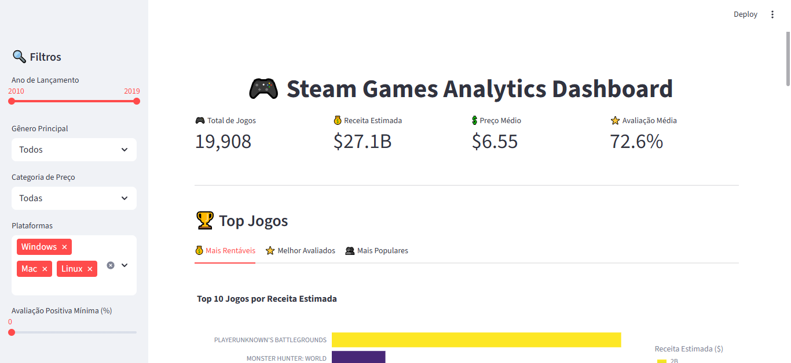
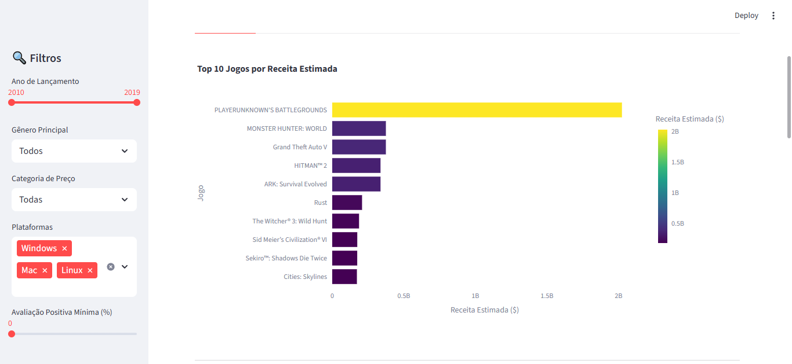
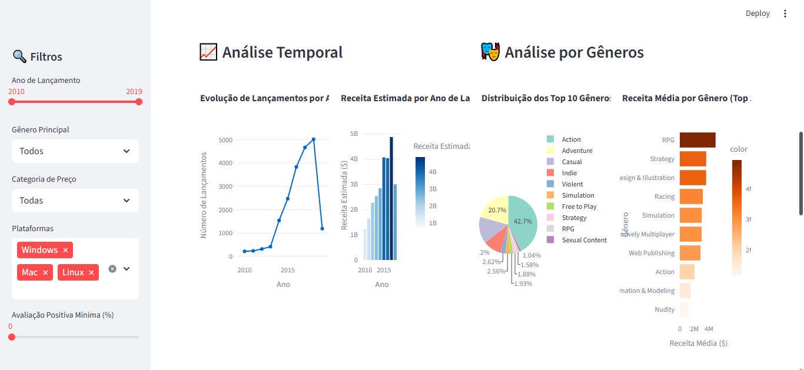
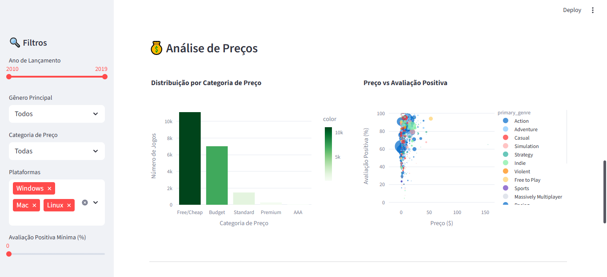
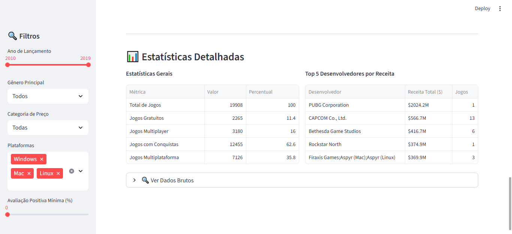

# 🎮 Steam Games ETL Dashboard

Um projeto completo de **ETL (Extract, Transform, Load)** para análise de dados de jogos do Steam, com dashboard interativo para visualização dos insights.

## 📋 Índice

- [Sobre o Projeto](#-sobre-o-projeto)
- [Estrutura do Projeto](#-estrutura-do-projeto)
- [Tecnologias Utilizadas](#-tecnologias-utilizadas)
- [Instalação e Configuração](#-instalação-e-configuração)
- [Como Usar](#-como-usar)
- [Pipeline ETL](#-pipeline-etl)
- [Dashboard](#-dashboard)
- [Funcionalidades](#-funcionalidades)
- [Decisões Técnicas](#-decisões-técnicas)
- [Resultados e Insights](#-resultados-e-insights)
- [Contribuição](#-contribuição)

## 🎯 Sobre o Projeto

Este projeto implementa um pipeline ETL completo para processar e analisar dados de jogos da plataforma Steam. O objetivo é transformar dados brutos em insights acionáveis através de:

- **Extração** de dados de arquivos CSV
- **Transformação** com limpeza, validação e criação de métricas
- **Carga** em múltiplos formatos (CSV, Excel, SQLite)
- **Visualização** através de dashboard interativo

## 📂 Estrutura do Projeto

```
etl_dashboard/
│
├── data/                    # Dados brutos e processados
│   ├── raw/                 # Dados originais
│   │   └── steam.csv        # Dataset original do Steam
│   └── processed/           # Dados limpos e processados
│       ├── steam_clean.csv  # Dados em CSV
│       └── steam_clean.xlsx # Dados em Excel (múltiplas abas)
│
├── src/                     # Código-fonte
│   ├── config.py           # Configurações globais
│   ├── extract.py          # Módulo de extração (Extract)
│   ├── transform.py        # Módulo de transformação (Transform)
│   ├── load.py             # Módulo de carga (Load)
│   └── dashboard.py        # Dashboard interativo (Streamlit)
│
├── screenshots/             # Capturas de tela do dashboard
│   ├── Screenshot1.png      # Dashboard principal
│   ├── Screenshot2.png      # KPIs e métricas
│   ├── Screenshot3.png      # Rankings e top lists
│   ├── Screenshot4.png      # Análises temporais
│   └── Screenshot5.png      # Análises por categoria
│
├── insights_output/         # Relatórios e gráficos gerados
├── steam.db                # Banco SQLite com dados processados
├── requirements.txt        # Dependências do projeto
├── run_pipeline.py         # Script principal do pipeline ETL
├── run_project.py          # Script de conveniência multiplataforma
├── generate_insights.py    # Gerador de insights automático
└── README.md               # Este arquivo
```

## 🛠 Tecnologias Utilizadas

### Core
- **Python 3.8+** - Linguagem principal
- **Pandas** - Manipulação e análise de dados
- **NumPy** - Computação numérica
- **SQLite3** - Banco de dados leve

### Visualização
- **Streamlit** - Framework para dashboard web
- **Plotly** - Gráficos interativos
- **Seaborn/Matplotlib** - Visualizações estatísticas

### Funcionalidades Adicionais
- **Requests** - Requisições HTTP (para APIs futuras)
- **OpenPyXl** - Manipulação de arquivos Excel
- **Python-dotenv** - Gerenciamento de variáveis de ambiente

## 🚀 Instalação e Configuração

### 1. Clone o repositório
```bash
git clone <url-do-repositorio>
cd etl_dashboard
```

### 2. Crie um ambiente virtual (recomendado)
```bash
python -m venv venv
# Windows
venv\Scripts\activate
# Linux/Mac
source venv/bin/activate
```

### 3. Instale as dependências
```bash
pip install -r requirements.txt
```

### 4. Verifique a estrutura de dados
Certifique-se de que o arquivo `data/raw/steam.csv` existe com os dados do Steam.

## 📖 Como Usar

### Executar Pipeline ETL Completo
```bash
# Execução completa (recomendado para primeira vez)
python run_pipeline.py

# Com logs verbosos
python run_pipeline.py --verbose

# Executar apenas etapas específicas
python run_pipeline.py --skip-extract    # Pula extração
python run_pipeline.py --skip-transform  # Pula transformação
python run_pipeline.py --skip-load      # Pula carga
```

## 🚀 Primeiros Passos (Quick Start)

### 1. Clone e Configure
```bash
git clone https://github.com/seu-usuario/steam-etl-dashboard.git
cd steam-etl-dashboard
python -m venv venv
source venv/bin/activate  # Linux/Mac
# ou
venv\Scripts\activate     # Windows
pip install -r requirements.txt
```

### 2. Execute o Pipeline
```bash
python run_pipeline.py
```

### 3. Abra o Dashboard
```bash
streamlit run src/dashboard.py
# Acesse: http://localhost:8501
```

> 💡 **Nota**: Os arquivos de saída (CSV, Excel, SQLite) são gerados automaticamente pelo pipeline. Não estão incluídos no repositório para mantê-lo leve.

### Executar Dashboard
```bash
# Após executar o pipeline, inicie o dashboard
streamlit run src/dashboard.py

# O dashboard será aberto em http://localhost:8501
```

### Executar Módulos Individualmente
```bash
# Teste individual dos módulos
python src/extract.py      # Teste de extração
python src/transform.py    # Teste de transformação
python src/load.py         # Teste de carga
```

## ⚙️ Pipeline ETL

### 1. **Extract (Extração)**
- Lê dados do arquivo CSV bruto
- Valida estrutura e qualidade dos dados
- Coleta metadados (tamanho, colunas, tipos)
- Opção para integração com APIs externas

**Principais funções:**
- `extract_csv_data()` - Carrega dados do CSV
- `get_data_info()` - Analisa qualidade dos dados
- `extract_steam_api_data()` - Extensão para APIs (opcional)

### 2. **Transform (Transformação)**
- **Limpeza básica**: Remove duplicatas, trata valores nulos
- **Transformação de datas**: Converte e extrai componentes temporais
- **Métricas calculadas**: Cria indicadores de negócio
- **Dados categóricos**: Processa gêneros, plataformas, categorias
- **Regras de negócio**: Aplica filtros e validações

**Métricas criadas:**
- `total_ratings` - Total de avaliações
- `positive_percentage` - Percentual de avaliações positivas
- `estimated_revenue` - Receita estimada
- `quality_score` - Score de qualidade (combinado)
- `price_category` - Categoria de preço
- `popularity_tier` - Nível de popularidade

### 3. **Load (Carga)**
- **CSV**: Arquivo simples para análises externas
- **Excel**: Múltiplas abas com diferentes visões dos dados
- **SQLite**: Banco normalizado com tabelas auxiliares e índices

**Tabelas criadas:**
- `games` - Tabela principal
- `genre_statistics` - Estatísticas por gênero
- `year_statistics` - Estatísticas por ano
- `top_revenue` - Top jogos por receita
- `top_quality` - Top jogos por qualidade

## 📊 Dashboard

### Funcionalidades Principais

#### 🔍 **Filtros Interativos**
- **Período**: Filtro por ano de lançamento
- **Gênero**: Seleção por gênero principal
- **Preço**: Categoria de preço
- **Plataformas**: Windows, Mac, Linux
- **Avaliação**: Percentual mínimo de avaliações positivas

#### 📈 **KPIs Principais**
- Total de jogos no dataset
- Receita estimada total
- Preço médio dos jogos
- Avaliação média dos usuários

#### 🏆 **Rankings e Top Lists**
- **Top 10 mais rentáveis**: Por receita estimada
- **Top 10 melhor avaliados**: Por score de qualidade
- **Top 10 mais populares**: Por número de owners

#### 📊 **Análises Temporais**
- Evolução de lançamentos por ano
- Receita estimada por ano de lançamento
- Tendências temporais do mercado

#### 🎭 **Análises por Gênero**
- Distribuição de jogos por gênero
- Receita média por categoria
- Comparações entre gêneros

#### 💰 **Análises de Preço**
- Distribuição por categoria de preço
- Relação preço vs avaliação
- Análise de jogos gratuitos vs pagos

### Screenshots do Dashboard

#### 🏠 **Dashboard Principal - Visão Geral**

*Dashboard principal mostrando KPIs, filtros interativos e gráficos de análise*

#### 📊 **KPIs e Métricas Principais**

*Indicadores principais: Total de jogos, receita estimada, preço médio e avaliação*

#### 🏆 **Rankings e Top Lists**

*Top 10 jogos mais rentáveis, melhor avaliados e mais populares*

#### 📈 **Análises Temporais**

*Evolução de lançamentos por ano e receita estimada por período*

#### 🎭 **Análises por Gênero e Preço**

*Distribuição por gêneros, categorias de preço e análises detalhadas*

> 💡 **Como navegar**: Use os filtros na sidebar esquerda para refinar os dados por ano, gênero, categoria de preço, plataformas e avaliação mínima. Todos os gráficos são interativos!

## 🧠 Decisões Técnicas

### **Arquitetura**
- **Modularidade**: Cada etapa do ETL em módulo separado
- **Configuração centralizada**: Arquivo `config.py` com todas as configurações
- **Logging estruturado**: Rastreabilidade completa do processo
- **Tratamento de erros**: Validações e recuperação graceful

### **Transformações de Dados**
- **Filtro temporal**: Jogos a partir de 2010
- **Qualidade dos dados**: Mínimo de 10 avaliações por jogo
- **Métricas de negócio**: Score de qualidade combinando avaliações e playtime
- **Categorização inteligente**: Preços e popularidade em tiers

### **Performance**
- **Cache de dados**: Streamlit cache para consultas rápidas
- **Índices de banco**: Otimização de consultas SQLite
- **Amostragem**: Gráficos de dispersão com sampling para datasets grandes
- **Processamento em lotes**: Tratamento eficiente de grandes volumes

### **Extensibilidade**
- **API Integration**: Estrutura preparada para APIs externas
- **Múltiplos formatos**: Saída em CSV, Excel e SQLite
- **Configuração flexível**: Parâmetros ajustáveis via config
- **Modularidade**: Fácil adição de novas transformações

## 📈 Resultados e Insights

### **Insights do Dataset Steam**

- **Volume**: ~27.000 jogos analisados
- **Período**: Dados de 1998 a 2024
- **Qualidade**: Score médio de qualidade: 72.5/100

### **Principais Descobertas**
1. **Crescimento**: Explosão de lançamentos após 2010
2. **Gêneros**: Action e Indie dominam o mercado
3. **Preços**: Maioria dos jogos na faixa "Budget" ($5-15)
4. **Avaliações**: Correlação positiva entre preço e qualidade
5. **Plataformas**: 95% dos jogos suportam Windows

## 🖼️ Visualização do Projeto

### **Screenshots Disponíveis**
As capturas de tela do dashboard estão organizadas na pasta `screenshots/` e mostram:

1. **Dashboard Principal** (`Screenshot1.png`) - Visão geral completa
2. **KPIs e Métricas** (`Screenshot2.png`) - Indicadores principais
3. **Rankings** (`Screenshot3.png`) - Top lists interativas
4. **Análises Temporais** (`Screenshot4.png`) - Gráficos de evolução
5. **Análises Categóricas** (`Screenshot5.png`) - Distribuições por gênero/preço

### **Como Executar para Ver ao Vivo**
```bash
# 1. Execute o pipeline ETL
python run_pipeline.py

# 2. Abra o dashboard interativo
streamlit run src/dashboard.py

# 3. Acesse: http://localhost:8501
```

> 💡 **Dica**: As imagens no README são estáticas, mas o dashboard real é totalmente interativo com filtros dinâmicos!

## 🤝 Contribuição

### Como Contribuir
1. Fork o projeto
2. Crie uma branch para sua feature (`git checkout -b feature/AmazingFeature`)
3. Commit suas mudanças (`git commit -m 'Add some AmazingFeature'`)
4. Push para a branch (`git push origin feature/AmazingFeature`)
5. Abra um Pull Request

### Estrutura para Testes
```bash
# Adicionar testes unitários
tests/
├── test_extract.py
├── test_transform.py
├── test_load.py
└── test_dashboard.py
```

## 📄 Licença

Este projeto está sob a licença MIT. Veja o arquivo `LICENSE` para mais detalhes.

## 👨‍💻 Autor

**Emerson do Nascimento Rodrigues**
- GitHub: [@emerson-02](https://github.com/Emerson-02)
- LinkedIn: [Emerson Rodrigues](https://www.linkedin.com/in/emerson-rodrigues-dev/)
- Email: emersondonascimentorodrigues@gmail.com.com

## 🙏 Agradecimentos

- Dados fornecidos pela comunidade Steam
- Bibliotecas open-source utilizadas
- Documentação e tutoriais da comunidade Python

---
